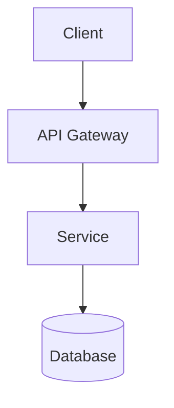
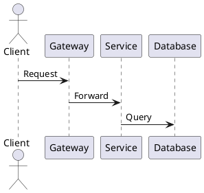

# Visualization Prompts

Agent instructions for generating diagrams and visual documentation.

## How to Use

1. Tell the agent to read this file: "Read visualization-prompts.md"
2. Describe what you need: "Create an architecture diagram for our API"
3. Agent will ask clarifying questions based on the diagram type
4. Agent generates the diagram in your preferred format (Mermaid, PlantUML, ASCII)

---

## When to Use

- System architecture documentation
- Explaining workflows to stakeholders
- Data flow visualization
- CI/CD pipeline documentation
- User journey mapping
- Database schema diagrams

---

## Diagram Types

### System Architecture

When user requests architecture diagram:

**1. Gather inputs:**
- System/project name
- Main components (services, databases, external integrations)
- What aspects to emphasize (data flow, service boundaries, protocols)
- Audience (technical team vs stakeholders)
- Preferred format (Mermaid, PlantUML, ASCII)

**2. Generate diagram showing:**
- Service boundaries
- Data flow directions
- External integrations
- Key protocols (HTTP, gRPC, WebSocket, etc.)

**3. Output:**
Diagram in requested format with brief legend if needed.

---

### Component Diagram

When user requests component/module diagram:

**1. Gather inputs:**
- Service or module to document
- Internal components and their responsibilities
- Key relationships and dependencies
- Level of detail needed

**2. Generate diagram showing:**
- Component boundaries
- Dependencies between components
- External interfaces
- Data flow within the module

---

### Data Flow

When user requests data flow visualization:

**1. Gather inputs:**
- Feature or process to visualize
- Data sources and destinations
- Transformation steps
- Error handling paths if relevant

**2. Generate diagram showing:**
- Source → transform → destination flow
- Data formats at each stage
- Validation/transformation points
- Error/fallback paths

**3. Output:**
Mermaid flowchart recommended for readability.

---

### CI/CD Pipeline

When user requests pipeline diagram:

**1. Gather inputs:**
- Project/repo name
- Pipeline stages (build, test, deploy)
- Environments (dev, staging, prod)
- Approval gates or manual steps
- Audience (technical vs management)

**2. Generate diagram showing:**
- Trigger conditions
- Stage sequence
- Parallel vs sequential steps
- Approval gates
- Rollback points
- Notification hooks

---

### Database Schema

When user requests ER diagram:

**1. Gather inputs:**
- Domain or feature area
- Entities and their key fields
- Relationships (one-to-many, many-to-many)
- Any constraints to highlight

**2. Generate diagram showing:**
- Entities with key fields
- Relationship types and cardinality
- Foreign key references
- Indexes if relevant

**3. Output:**
Mermaid erDiagram or ASCII table format.

---

### User Journey

When user requests journey map:

**1. Gather inputs:**
- Feature or flow to map
- User persona
- Entry point and completion state
- Decision points or branches
- Known pain points or drop-off risks

**2. Generate diagram showing:**
- Step sequence
- Decision branches
- Pain points flagged
- Success path highlighted

---

### Sequence Diagram

When user requests sequence diagram:

**1. Gather inputs:**
- Operation or API call to document
- Participants (client, services, databases)
- Message flow sequence
- Whether to include error paths

**2. Generate diagram showing:**
- Participant lifelines
- Request/response arrows
- Async vs sync calls
- Error paths if requested

**3. Output:**
Mermaid sequenceDiagram format.

---

### State Machine

When user requests state diagram:

**1. Gather inputs:**
- Entity or process with states
- All possible states
- Transitions and their triggers
- Error/recovery states

**2. Generate diagram showing:**
- States (initial, intermediate, final)
- Transition arrows with event labels
- Guard conditions if applicable
- Error recovery paths

---

## Output Formats

### Mermaid (Recommended)

Works in GitHub, GitLab, Notion, and most documentation tools.



### PlantUML

More features, requires renderer.



### ASCII

Universal fallback, works everywhere.

```
┌────────┐     ┌─────────┐     ┌─────────┐
│ Client │────>│ Gateway │────>│ Service │
└────────┘     └─────────┘     └─────────┘
```

---

## Integration with Documentation

Store diagrams in:
- `docs/architecture/` - System diagrams
- `docs/adr/` - Decision-specific diagrams
- `specs/` - Feature-specific flows

Reference in task details when visual context helps.
